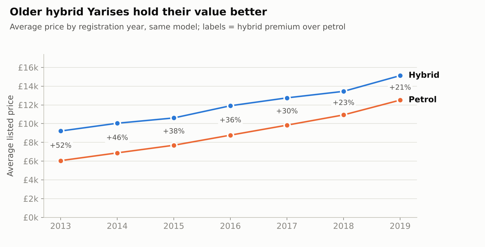
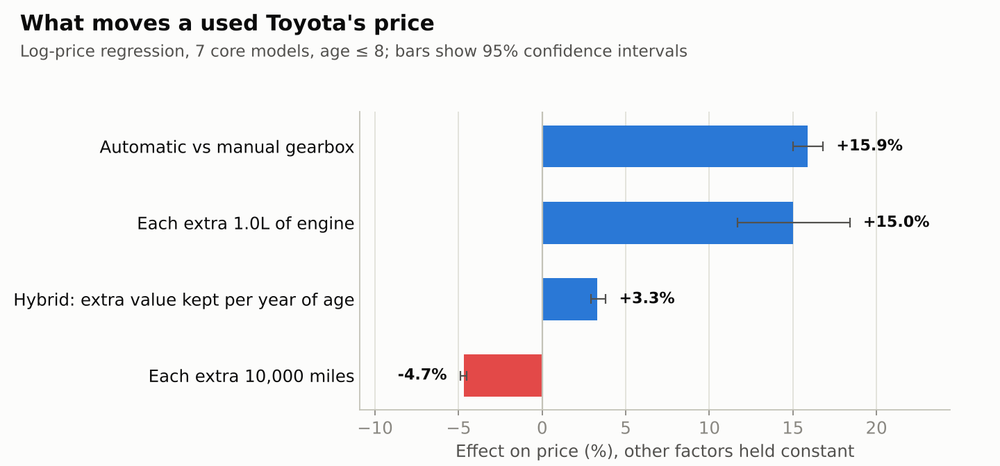
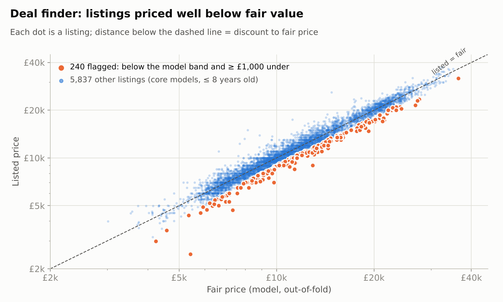

# Pricing Used Toyotas in the UK

**SQL · Python · statsmodels · scikit-learn** | Depreciation, price drivers and a fair-price model for a used-car dealer

[](https://colab.research.google.com/github/Raanank10/UK_Used_Car_Data/blob/main/notebooks/toyota_used_car_pricing.ipynb)

A dealer specialising in Toyota has three daily questions: **what is this car worth, what drives its value, and which listings are mispriced?** This project answers all three from 6,698 UK listings, using SQL for the business cuts, regression for explainable effects, and a cross-validated model for fair prices.

## Key findings



| # | Finding | Evidence |
|---|---|---|
| 1 | **Hybrids don't sell at a premium when new. They hold value better.** Once gearbox and engine are controlled for, a hybrid is worth about the same as a comparable petrol automatic at age 0, but it **keeps ~3.3% more of its value every year**. A petrol Yaris loses ~9.5% a year at constant mileage, a hybrid ~6.5%. | Regression, notebook §3 |
| 2 | **The raw "hybrid premium" of 20-50% is mostly the gearbox.** Every hybrid is automatic, and an automatic alone is worth **~16% more** than a manual. Comparing raw averages would overstate what the hybrid itself is worth. | `sql/03_hybrid_premium_matched.sql` + regression |
| 3 | **Every 10,000 miles costs ~4.7% of value**, on top of age. | Regression, notebook §3 |
| 4 | **The fair-price model prices 77% of listings within £1,000** (MAE £738), against 49% for a "same model and year" rule of thumb. The 2021 version of this project set an error target of 1,000. | 5-fold cross-validation, notebook §4 |
| 5 | **240 recent listings (3.9%) are flagged as buying leads**: below the bottom 5% of their model's price band and at least £1,000 under fair value. | Deal finder, notebook §5 |



## Fair-price model

| Approach | MAE | Median error | MAPE | Within £1,000 |
|---|---|---|---|---|
| Rule of thumb: median of same model and year | £1,487 | £1,005 | 14.4% | 48.5% |
| Linear regression on log price | £903 | £618 | 7.5% | 69.9% |
| **Gradient boosting** | **£738** | **£496** | **6.3%** | **76.8%** |

- **Every score is out-of-fold:** each listing is priced by a model that never saw it. Exact duplicate listings are removed first so a copy can't leak from training into testing.
- The model returns a **fair-price range (±10%)** built from its own out-of-fold errors, and it covers 80% of real listings.
- Accuracy is strongest on Yaris and Aygo (61% of the market, ~5-6% error). Hilux and Land Cruiser have few listings and wide trim spreads, so the deal finder excludes them.



## Deliverables

| File | What a dealer does with it |
|---|---|
| [`outputs/price_guide.csv`](outputs/price_guide.csv) | Price bands (25th percentile, median, 75th percentile) by model and age band, for quick trade-in quotes |
| [`outputs/flagged_listings.csv`](outputs/flagged_listings.csv) | Ranked buying leads with fair price and discount |
| [`notebooks/toyota_used_car_pricing.ipynb`](notebooks/toyota_used_car_pricing.ipynb) | The full analysis, reproducible end to end |
| [`sql/`](sql/) | Inventory mix, depreciation with window functions (`LAG`, `FIRST_VALUE`), matched hybrid-vs-petrol comparison |

## Limitations

- These are **listing prices, not transaction prices**, so negotiated discounts are invisible.
- There are **no trim, condition or service-history fields**. That is most of the remaining error, and the main reason a flagged listing still needs a human check.
- The data is a **single snapshot from around 2020**. UK used-car prices rose sharply in 2021-22, so absolute £ levels are dated, but the *relative* effects (age, mileage, gearbox, hybrid retention) are the transferable part.
- The hybrid and automatic effects are partly entangled, because every hybrid is automatic. The automatic premium is identified from petrol automatics.

## Run it

```bash
pip install -r requirements.txt
jupyter notebook notebooks/toyota_used_car_pricing.ipynb
```

## Data and history

- **Data:** the Toyota file from the [100,000 UK Used Car Data set](https://www.kaggle.com/datasets/adityadesai13/used-car-dataset-ford-and-mercedes) on Kaggle.
- **History:** this project started in 2021 as a team regression exercise with Elad K. ([@eladk23](https://github.com/eladk23)). The original notebook and write-up are in [`archive/2021/`](archive/2021/). The 2026 rebuild reframes it around dealer decisions and adds the SQL layer, deduplication, interpretable effects, cross-validated evaluation, a fair-price range and the deal finder.

---
**Raanan Kelner**, Data Analyst · [LinkedIn](https://www.linkedin.com/in/raanan-kelner)
